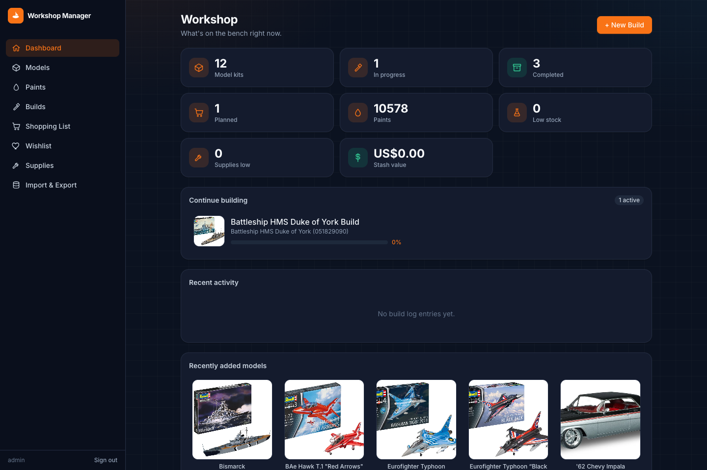

# Model Workshop Manager

**Track your model kit stash, paint shelf, and builds — self-hosted, on your own hardware.**

No more guessing whether you already own that Revell kit, digging through drawers to check if
you have the right shade of Tamiya paint, or losing track of build progress. Model Workshop
Manager keeps your catalog, inventory, and builds in one place, installable as an app on your
phone or desktop, running entirely on your own server.



## What it does

- **Dashboard** — kit/paint/build counts, low-stock paints, missing-paint alerts, recent activity.
- **Models & Paints** — a searchable catalog, kept separate from what you actually own.
- **Builds** — start a build in one guided flow, log progress with timestamps and photos, and get
  automatic "required vs. owned" paint matching per project.
- **Shopping list & Wishlist** — one tap turns a build's missing paints into a shopping list;
  longer-term wants live separately in the wishlist.
- **Supplies** — track tools and consumables (brushes, cement, masking tape, etc.) too.
- **Import & export** — bring in an existing collection via CSV/JSON, back it up from the UI.
- **PWA** — installable on your phone, works offline as an app shell.
- **Login-protected** — single-user auth, nothing exposed without a password.

## Quick start (Docker)

```bash
git clone <this-repo-url> && cd model-workshop-manager
cp .env.example .env          # set AUTH_USERNAME, AUTH_PASSWORD, SESSION_SECRET
docker compose up -d --build
docker compose exec backend npm run db:migrate
docker compose exec backend npm run db:seed   # optional: sample data
```

Open `http://localhost:8080` (or whatever `HOST_PORT` you set) and log in.

**Updating:** `git pull && docker compose up -d --build`
**Stopping:** `docker compose down` (your data lives in the `workshop-data` volume, untouched)

> **Before you expose this anywhere:** it's a single-user app meant for your LAN or a VPN
> (Tailscale/WireGuard), not the open internet. See [Security](#security) below.

### Environment variables

All set in `.env` (copied from `.env.example`), read by `docker-compose.yml`.

| Variable | Required | Default | What it does |
|---|---|---|---|
| `AUTH_USERNAME` | Yes | — | Login username. App refuses to start without it. |
| `AUTH_PASSWORD` | Yes | — | Login password. |
| `SESSION_SECRET` | Yes | — | Signs the session cookie. Any string works — generate one with `openssl rand -base64 32`. |
| `SESSION_COOKIE_SECURE` | No | `false` | Set `true` once served over HTTPS — otherwise the browser won't send the cookie and login silently fails. |
| `HOST_PORT` | No | `8080` | Host port the app is served on. |
| `WORKSHOP_DATA_DIR` | No | *(named volume)* | Host path for the database + uploaded photos, instead of the `workshop-data` Docker volume — e.g. a NAS mount. |
| `BACKUP_DIR` | No | `./backups` | Host path where backups (in-app, manual script, and the nightly job) are written. |
| `BACKUP_RETENTION_DAYS` | No | `14` | How many days of nightly backups to keep before pruning. |
| `UPCITEMDB_ENABLED` | No | `false` | Turns on the optional barcode-lookup convenience provider (see Data import below). |

## Tech stack

React + TypeScript PWA &rarr; Fastify REST API &rarr; Drizzle ORM &rarr; SQLite, all behind Docker
Compose. Photos live on disk, never as DB blobs.

## Local development

Requires Node.js 22+ (see `.nvmrc` — `better-sqlite3` needs a matching native build; older Node
versions fail silently instead of erroring).

```bash
# Backend
cd apps/backend && npm install
npm run db:migrate && npm run db:seed   # first time only
npm run dev                              # Fastify on :3001

# Frontend (separate terminal)
cd apps/frontend && npm install
npm run dev                              # Vite on :5173, proxying /api to :3001
```

Open `http://localhost:5173`. Run backend tests with `npm test` inside `apps/backend`.

## Security

This is a **single-user private app** and it requires login — but login raises the bar, it isn't
a substitute for not exposing an unaudited personal app to the open internet. Keep it behind a
reverse proxy, LAN-only or on a VPN.

<details>
<summary>Implementation details</summary>

- The whole API is protected by default (allow-list of exactly three public paths:
  `/api/health`, `/api/auth/login`, `/api/auth/me`) — new routes are guarded automatically.
- Credentials are a single username/password pair from `AUTH_USERNAME`/`AUTH_PASSWORD` env vars
  (no user table — deliberately single-user), compared in constant time.
- Sessions are a signed, `httpOnly` cookie (`@fastify/secure-session`) — no server-side session
  store to run or lose.
- The login endpoint is rate-limited (5 attempts/minute).
- The app **refuses to start** if `AUTH_USERNAME`, `AUTH_PASSWORD`, or `SESSION_SECRET` aren't
  set — see `.env.example`.
- Set `SESSION_COOKIE_SECURE=true` once this is served over HTTPS, otherwise the browser won't
  send the cookie and login will silently fail.
- File uploads are size-capped (25 MB/file) but not otherwise scanned.

</details>

## Backup & restore

Three ways to get a backup, easiest first: the **Backups tab** in the app (create, list,
download, restore, delete), an **automated nightly snapshot** (a `docker-volume-backup` sidecar
container, on by default), or `./scripts/backup.sh` for a manual one from the shell. All three
produce the same tarball format, so a backup from any one can be restored via any other.

<details>
<summary>Details</summary>

- **In-app Backups tab** (Import & Export page) — the easiest path day to day.
- **Automated nightly backup** — the `backup` service in `docker-compose.yml`
  ([`offen/docker-volume-backup`](https://github.com/offen/docker-volume-backup)) snapshots the
  `workshop-data` volume to `BACKUP_DIR` every night at 03:00, pruning by `BACKUP_RETENTION_DAYS`.
  Point `BACKUP_DIR` at a real host path already covered by whatever backs up your other apps.
- **Manual script** — `./scripts/backup.sh` writes a timestamped `.tar.gz` of the database and
  uploaded photos to `$BACKUP_DIR`. Restore steps are in the comments at the top of the script:
  stop the stack, extract the tarball's `database/` and `uploads/` into the `workshop-data`
  volume, restart.

</details>

## Contributing

Bug reports, feature requests, and PRs are welcome — see
[CONTRIBUTING.md](CONTRIBUTING.md) for dev setup, conventions, and the sign-off
requirement on commits. Please also read the
[Code of Conduct](CODE_OF_CONDUCT.md). Found a security issue? See
[SECURITY.md](SECURITY.md) instead of opening a public issue.

## License

[MIT](LICENSE)
